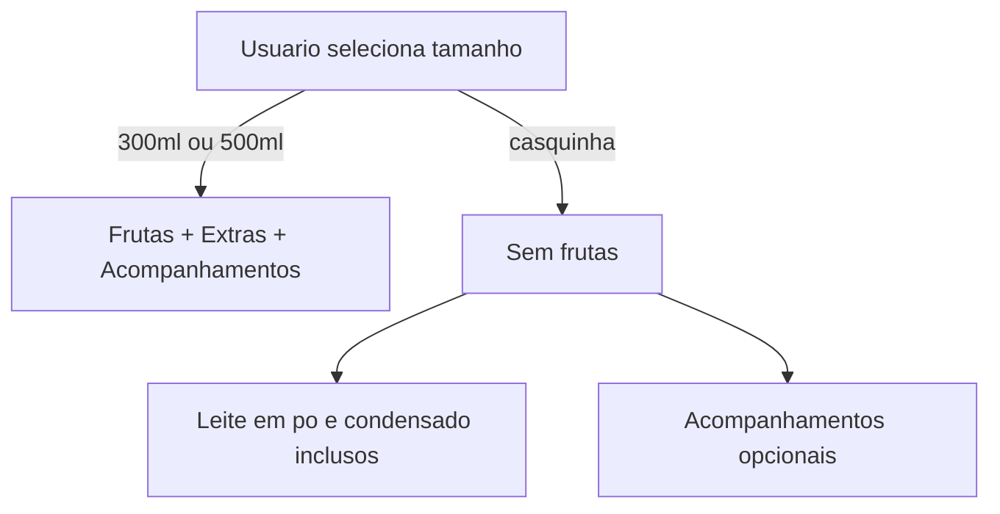

# Plano: Açaí na casquinha

## Contexto

O app monta pedidos de açaí via [`src/menu.json`](src/menu.json) + [`src/components/BowlBuilder.tsx`](src/components/BowlBuilder.tsx). Hoje existem apenas dois tamanhos (300ml / 500ml). Cada item do pedido é um `BowlLine` com `sizeId` + `toppingIds`.

A abordagem mais simples e alinhada ao código existente é tratar **"na casquinha" como um terceiro tamanho** no `menu.json`, com metadado que desabilita categorias de frutas na UI.



## Mudanças por arquivo

### 1. Cardápio — [`src/menu.json`](src/menu.json)

Adicionar o novo tamanho com preço fixo e regra de categorias desabilitadas:

```json
{
  "id": "casquinha",
  "name": "Na casquinha",
  "price": 8,
  "disabledCategories": ["frutas", "frutas-extras"]
}
```

Os tamanhos 300ml/500ml permanecem sem `disabledCategories` (comportamento atual).

### 2. Tipos — [`src/types.ts`](src/types.ts)

Nenhuma mudança estrutural em `BowlLine` — `SizeId` passará a incluir `"casquinha"` automaticamente via inferência do JSON.

Opcionalmente, exportar um tipo auxiliar para tamanhos com regras:

```ts
export type Size = MenuConfig["sizes"][number]
```

### 3. Helpers de menu — [`src/lib/menu.ts`](src/lib/menu.ts)

Adicionar funções pequenas reutilizáveis:

- `getDisabledCategories(sizeId)` — retorna `string[]` (vazio se não houver regra)
- `isCategoryDisabledForSize(sizeId, categoryId)` — usado na UI
- `filterAllowedToppings(sizeId, toppingIds)` — remove toppings de categorias desabilitadas (útil ao trocar de tamanho)

A lógica de preço **não muda**: `calcBowlLineTotal` já usa `size.price` (8) + acompanhamentos opcionais.

### 4. UI do montador — [`src/components/BowlBuilder.tsx`](src/components/BowlBuilder.tsx)

**Seleção de tamanho**
- O grid `grid-cols-3` já comporta 3 botões; o terceiro aparecerá automaticamente ao adicionar no JSON.

**Ao trocar para casquinha** (`setSizeId`):
- Limpar `toppingIds` de frutas e frutas-extras via `filterAllowedToppings`
- Manter acompanhamentos já selecionados

**Renderização de categorias**:
- Para categorias em `disabledCategories`: ocultar a seção inteira **ou** exibir desabilitada com texto explicativo — recomendação: **ocultar** frutas/frutas-extras e mostrar nota contextual:

> "Açaí na casquinha acompanha leite em pó e leite condensado. Adicionais opcionais abaixo."

**Textos dinâmicos**:
- Subtítulo do card: "Até 2 frutas inclusas no copo" só quando tamanho **não** for casquinha
- Nota de leites: adaptar para casquinha ("Acompanha leite em pó e leite condensado") vs copos ("Todos os tamanhos acompanham...")

**`toggleTopping`**: bloquear seleção se categoria estiver desabilitada para o `sizeId` atual (defesa extra).

### 5. Carrinho — [`src/components/OrderCart.tsx`](src/components/OrderCart.tsx)

Ajuste mínimo: o rótulo `Açaí {size.name}` já funcionará como **"Açaí Na casquinha"**.

Quando não houver complementos selecionados, exibir **"Leite em pó e leite condensado"** em vez de "Sem complementos" — apenas para `sizeId === "casquinha"`.

### 6. WhatsApp — [`src/lib/whatsapp.ts`](src/lib/whatsapp.ts)

Mesmo ajuste de exibição: para casquinha sem acompanhamentos, listar:

```
• Leite em pó e leite condensado
```

em vez de "Sem complementos".

### 7. Documentação — [`README.md`](README.md)

Atualizar seção de precificação com o novo tamanho e regra de frutas desabilitadas.

## Comportamento esperado

| Cenário | Resultado |
|---------|-----------|
| Casquinha sem adicionais | R$ 8,00 |
| Casquinha + Paçoca (R$ 2) | R$ 10,00 |
| Casquinha + 2x quantidade | R$ 16,00 (+ talher se marcado) |
| Trocar de 300ml (com frutas) para casquinha | Frutas removidas automaticamente |
| Trocar de casquinha para 500ml | Acompanhamentos mantidos; frutas liberadas |

## Verificação manual

1. Selecionar "Na casquinha" → seções Frutas e Frutas Extras não aparecem (ou ficam bloqueadas)
2. Adicionar acompanhamentos opcionais → preço = R$ 8 + soma dos adicionais
3. Adicionar ao pedido → carrinho mostra "1x Açaí Na casquinha" com preço correto
4. Confirmar pedido → mensagem WhatsApp com leites mencionados e total R$ 8,00+
5. Alternar entre tamanhos e validar limpeza de frutas

## Escopo fora desta entrega

- Testes automatizados (projeto não possui suite hoje)
- Toggle explícito de leite condensado/pó (continuam apenas informativos, como nos copos)
- Talher opcional permanece disponível para casquinha (não mencionado pelo usuário)

## Nota sobre cópia do plano

Em Plan Mode a cópia em `/Users/bbox/Projects/DevTech/notes/ia/plans` será salva na fase de implementação, após sua aprovação.
