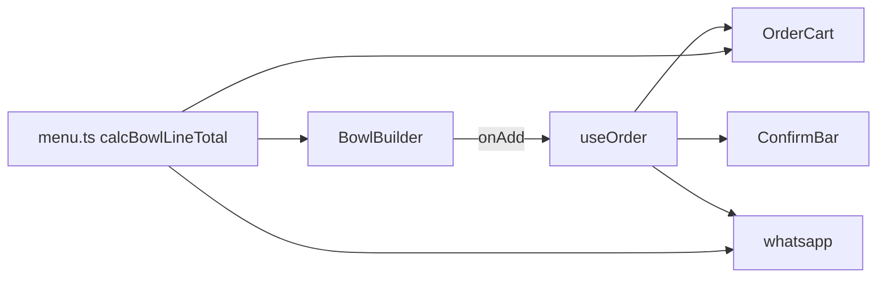

# Adicionar opção de talher (+R$ 0,50)

## Contexto

O fluxo atual monta cada copo em [`BowlBuilder.tsx`](src/components/BowlBuilder.tsx), salva em `BowlLine` via [`useOrder.ts`](src/hooks/useOrder.ts), calcula preço com [`calcBowlLineTotal`](src/lib/menu.ts) e exibe no [`OrderCart`](src/components/OrderCart.tsx) / WhatsApp ([`whatsapp.ts`](src/lib/whatsapp.ts)).



Escopo confirmado: **talher por copo** (cada linha do carrinho pode ter ou não).

## Comportamento

- Checkbox "Deseja talher?" no montador, com texto informativo fixo: *"O talher custa R$ 0,50 por unidade."*
- Se marcado: **+R$ 0,50 × quantidade** na linha (2 copos com talher = R$ 1,00).
- Mensagem de destaque (estilo âmbar, igual frutas extras) só quando marcado: *"Talher: +R$ 0,50"* (ou valor total se quantidade > 1).
- Ao adicionar ao pedido, resetar `wantsCutlery` para `false` (junto com toppings/notas/quantidade).

## Alterações por arquivo

### 1. [`src/lib/menu.ts`](src/lib/menu.ts)

- Constante exportada: `CUTLERY_PRICE = 0.5`
- Estender assinatura de `calcBowlLineTotal`:

```ts
export function calcBowlLineTotal(
  sizeId: string,
  toppingIds: string[],
  quantity: number,
  wantsCutlery = false
): number {
  const size = getSize(sizeId)
  if (!size) return 0
  const unit = size.price + calcBowlUnitPrice(toppingIds)
  const cutlery = wantsCutlery ? CUTLERY_PRICE * quantity : 0
  return unit * quantity + cutlery
}
```

### 2. [`src/types.ts`](src/types.ts)

- Adicionar `wantsCutlery: boolean` em `BowlLine`
- Atualizar props de `onAdd` em `BowlBuilder` para incluir o campo

### 3. [`src/components/BowlBuilder.tsx`](src/components/BowlBuilder.tsx)

- Estado: `const [wantsCutlery, setWantsCutlery] = useState(false)`
- Incluir `wantsCutlery` nos `useMemo` de `lineTotal` e no `unitPrice` exibido (mostrar acréscimo de talher no preço unitário apenas se marcado)
- Nova seção compacta **antes de "Observações"** (após os avisos de frutas/complementos):

```tsx
<div>
  <label className="flex items-start gap-2">
    <input type="checkbox" checked={wantsCutlery} onChange={...} />
    <span>Deseja talher?</span>
  </label>
  <p className="mt-1 text-sm text-zinc-500">O talher custa {brl.format(CUTLERY_PRICE)} por unidade.</p>
</div>
```

- `handleAdd`: passar `wantsCutlery` e resetar para `false`

### 4. [`src/components/OrderCart.tsx`](src/components/OrderCart.tsx)

- Passar `bowl.wantsCutlery` para `calcBowlLineTotal`
- Se `wantsCutlery`, exibir linha secundária: *"Com talher (+R$ 0,50/un.)"* ou valor total da taxa

### 5. [`src/lib/whatsapp.ts`](src/lib/whatsapp.ts)

- Passar `bowl.wantsCutlery` em `calcBowlLineTotal`
- Se marcado, adicionar linha no item: `• Talher (+R$ 0,50)` (ou total da taxa quando quantidade > 1)

## UI

Reutilizar classes existentes (`.label`, texto `text-sm text-zinc-500`, alerta âmbar `bg-amber-50`). Sem novos estilos globais — checkbox nativo com `accent-color` ou classes Tailwind simples.

## Verificação manual

1. Montar copo sem talher → preço inalterado
2. Marcar talher → badge de total e preço/un. sobem R$ 0,50
3. Quantidade 2 + talher → acréscimo de R$ 1,00
4. Carrinho e barra de confirmação refletem o total correto
5. Mensagem WhatsApp lista talher no item correspondente
