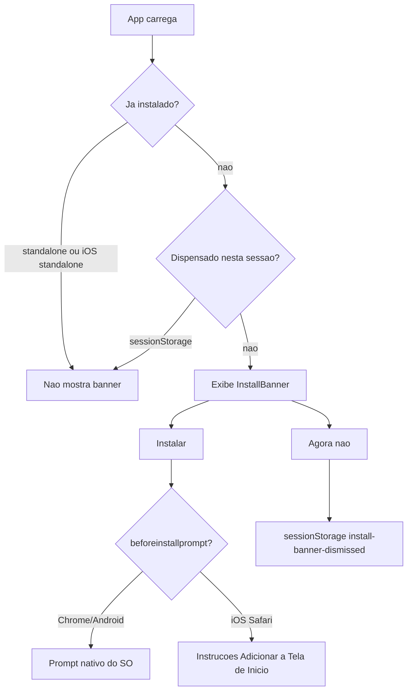

# PWA com banner de instalação

## Contexto atual

- Stack: **Vite 5 + React 19 + TypeScript + Tailwind** ([`package.json`](package.json))
- Sem PWA, sem pasta `public/`, sem service worker
- Já existe `theme-color: #7e22ce` e branding roxo (`acai-700`) em [`index.html`](index.html) e [`tailwind.config.js`](tailwind.config.js)
- Nome da loja vem de `VITE_STORE_NAME` (usado em [`src/App.tsx`](src/App.tsx))

## Arquitetura



## 1. Dependência e configuração PWA

**Instalar:** `vite-plugin-pwa` (gera manifest + service worker via Workbox)

**Atualizar** [`vite.config.ts`](vite.config.ts):

```ts
import { VitePWA } from "vite-plugin-pwa"

VitePWA({
  registerType: "autoUpdate",
  includeAssets: ["icons/*.png"],
  manifest: {
    name: "Custom Açaí — Monte seu pedido",
    short_name: "Custom Açaí",
    description: "Monte seu açaí e envie o pedido pelo WhatsApp",
    theme_color: "#7e22ce",
    background_color: "#faf5ff",
    display: "standalone",
    lang: "pt-BR",
    start_url: "/",
    icons: [
      { src: "icons/icon-192.png", sizes: "192x192", type: "image/png" },
      { src: "icons/icon-512.png", sizes: "512x512", type: "image/png" },
      { src: "icons/icon-512.png", sizes: "512x512", type: "image/png", purpose: "maskable" },
    ],
  },
  workbox: {
    globPatterns: ["**/*.{js,css,html,ico,png,svg,woff2}"],
    runtimeCaching: [
      {
        urlPattern: /^https:\/\/fonts\.googleapis\.com\/.*/i,
        handler: "CacheFirst",
        options: { cacheName: "google-fonts-cache", expiration: { maxEntries: 10, maxAgeSeconds: 60 * 60 * 24 * 365 } },
      },
    ],
  },
  devOptions: { enabled: true }, // permite testar PWA em `npm run dev`
})
```

**Registrar o SW** em [`src/main.tsx`](src/main.tsx) via `virtual:pwa-register` (padrão do plugin) para atualizações automáticas.

## 2. Ícones e assets (`public/`)

Criar pasta [`public/icons/`](public/icons/) com:

| Arquivo | Uso |
|---------|-----|
| `icon-192.png` | Manifest (mínimo PWA) |
| `icon-512.png` | Manifest + splash |
| `apple-touch-icon.png` | iOS (180×180) |

Visual alinhado ao header existente: fundo `acai-700` (#7e22ce) com emoji 🥤 centralizado (mesmo estilo do [`Header.tsx`](src/components/Header.tsx)).

**Atualizar** [`index.html`](index.html):

- `link rel="apple-touch-icon"` apontando para `/icons/apple-touch-icon.png`
- `meta name="apple-mobile-web-app-capable" content="yes"`
- `meta name="apple-mobile-web-app-status-bar-style" content="default"`
- Manter `theme-color` existente

## 3. Utilitários PWA

**Novo** [`src/lib/pwa.ts`](src/lib/pwa.ts):

- `isAppInstalled()` — retorna `true` se:
  - `window.matchMedia("(display-mode: standalone)").matches`
  - ou `(navigator as Navigator & { standalone?: boolean }).standalone` (iOS Safari em modo app)
- `isBannerDismissed()` / `dismissInstallBanner()` — leitura/escrita em `sessionStorage` com chave `install-banner-dismissed` (dispensar só na sessão atual; nova aba/sessão ou visita em outro dia mostra de novo)

**Novo** [`src/hooks/useInstallPrompt.ts`](src/hooks/useInstallPrompt.ts):

- Escuta `beforeinstallprompt`, chama `preventDefault()` e guarda o evento deferido
- Expõe `canInstall` (evento capturado) e `promptInstall()` (chama `prompt()` nativo)
- Limpa o listener no unmount
- Tipagem de `BeforeInstallPromptEvent` em [`src/vite-env.d.ts`](src/vite-env.d.ts)

## 4. Componente do banner

**Novo** [`src/components/InstallBanner.tsx`](src/components/InstallBanner.tsx):

- Posição: barra fixa no topo (`z-40`, acima do header `z-20` e da ConfirmBar `z-30`)
- Estilo: gradiente/fundo `acai-700`, texto branco, botões com classes existentes `.btn-primary` / `.btn-secondary` adaptadas para contraste
- Texto principal: *"Instale o app para acesso rápido ao seu pedido"*
- Botões:
  - **Instalar** — chama `promptInstall()` quando `canInstall`; em iOS (sem evento), expande instrução: *Compartilhar → Adicionar à Tela de Início*
  - **Agora não** — chama `dismissInstallBanner()` e esconde
- Lógica de visibilidade no mount:
  - `!isAppInstalled() && !isBannerDismissed()` → mostrar
  - Caso contrário → não renderizar

**Integrar** em [`src/App.tsx`](src/App.tsx) como primeiro filho do layout (antes do `Header`).

## 5. Comportamento por plataforma

| Cenário | Banner | Botão Instalar |
|---------|--------|----------------|
| Chrome/Android (não instalado) | Sim, a cada load (se não dispensado na sessão) | Abre prompt nativo |
| iOS Safari (não instalado) | Sim | Mostra instruções manuais |
| App já instalado (standalone) | Não | — |
| Dispensado nesta sessão | Não até fechar aba | — |
| Desktop sem critérios PWA | Banner pode aparecer, botão Instalar desabilitado ou com texto alternativo | — |

## 6. Verificação

Após implementação:

1. `npm run build && npm run preview` — inspecionar Application → Manifest e Service Worker no DevTools
2. Lighthouse → categoria PWA (manifest válido, SW registrado, ícones)
3. Emulador mobile: banner visível no load; "Agora não" esconde; recarregar na mesma aba mantém escondido; nova aba mostra de novo
4. Modo standalone (ou DevTools → Application → Manifest → "Open in new window") → banner não aparece

**Nota de deploy:** PWA em produção exige **HTTPS** (localhost é exceção). Garantir que o host de deploy sirva sobre HTTPS.

## Arquivos alterados/criados

| Ação | Arquivo |
|------|---------|
| Modificar | [`vite.config.ts`](vite.config.ts) |
| Modificar | [`src/main.tsx`](src/main.tsx) |
| Modificar | [`index.html`](index.html) |
| Modificar | [`src/App.tsx`](src/App.tsx) |
| Modificar | [`src/vite-env.d.ts`](src/vite-env.d.ts) |
| Modificar | [`package.json`](package.json) |
| Criar | `public/icons/icon-192.png`, `icon-512.png`, `apple-touch-icon.png` |
| Criar | [`src/lib/pwa.ts`](src/lib/pwa.ts) |
| Criar | [`src/hooks/useInstallPrompt.ts`](src/hooks/useInstallPrompt.ts) |
| Criar | [`src/components/InstallBanner.tsx`](src/components/InstallBanner.tsx) |
