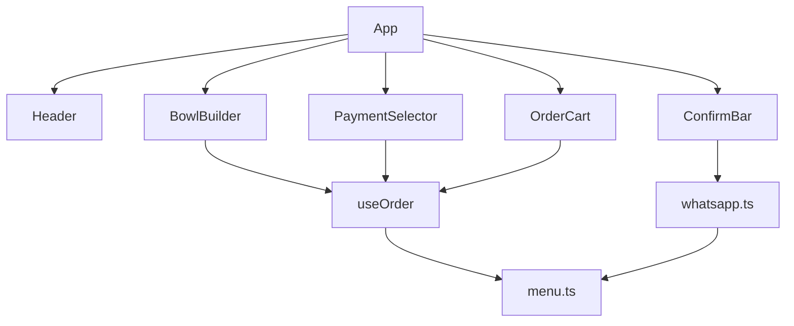

# Plano: README com documentação e imagens

## Contexto

- O [README.md](README.md) está **vazio**.
- Já existe documentação rica em:
  - [docs/releases/v1.0/RELEASE_NOTES.md](docs/releases/v1.0/RELEASE_NOTES.md) — base principal
  - [docs/releases/v1.0/GITHUB_RELEASE.md](docs/releases/v1.0/GITHUB_RELEASE.md) — versão resumida com URLs absolutas
  - [CHANGELOG.md](CHANGELOG.md) — histórico de versões
- **9 screenshots** prontas em [docs/releases/v1.0/screenshots/](docs/releases/v1.0/screenshots/)
- **Ícone do projeto** em [public/icons/icon-512.png](public/icons/icon-512.png)
- Estado atual do código ([src/App.tsx](src/App.tsx)): PWA ativo (manifest + SW), **sem** `InstallBanner` (removido no commit `0366310`). Telefone WhatsApp **hardcoded**; apenas `VITE_STORE_NAME` é lido do `.env`.

## Abordagem

Adaptar o conteúdo das release notes para um README de repositório: mais enxuto que `RELEASE_NOTES.md`, mas completo o suficiente para um desenvolvedor ou lojista entender, instalar e configurar o projeto. Usar **caminhos relativos** nas imagens para renderizar corretamente no GitHub.

```markdown

```

## Estrutura proposta do README

### 1. Cabeçalho
- Título: **Custom Açaí**
- Logo centralizado: `public/icons/icon-512.png`
- Descrição em 1–2 frases (PWA para montar pedidos de açaí e enviar pelo WhatsApp)
- Link para repositório e versão atual (v1.0.0)

### 2. Funcionalidades (visão geral)
Bullets agrupados por área, extraídos do [CHANGELOG.md](CHANGELOG.md):
- Montador de copos (300ml/500ml, frutas, extras, talher, observações)
- Carrinho com totais e remoção
- Pagamento (PIX, Dinheiro, Crédito, Débito)
- Integração WhatsApp com mensagem formatada
- PWA instalável (manifest, service worker, ícones)
- Layout responsivo
- Cardápio configurável via [src/menu.json](src/menu.json)

### 3. Capturas de tela (todas as 9 imagens)
Seção com subseções e imagens, espelhando [RELEASE_NOTES.md](docs/releases/v1.0/RELEASE_NOTES.md):

| # | Arquivo | Legenda |
|---|---------|---------|
| 01 | `01-home-desktop.png` | Tela inicial desktop |
| 02 | `02-bowl-builder.png` | Montador de açaí |
| 03 | `03-cutlery-option.png` | Opção de talher (+R$ 0,50) |
| 04 | `04-cart-with-items.png` | Carrinho com itens |
| 05 | `05-payment-selector.png` | Forma de pagamento |
| 06 | `06-confirm-bar.png` | Barra de confirmação + WhatsApp |
| 07 | `07-install-banner-mobile.png` | Banner PWA mobile |
| 08 | `08-install-banner-ios-hint.png` | Instruções iOS |
| 09 | `09-pwa-manifest-devtools.png` | Manifest no DevTools |

**Nota obrigatória** (conforme sua escolha): após as screenshots 07–08, incluir bloco de aviso explicando que o **banner customizado de instalação foi removido** na versão atual; as imagens referem-se à v1.0.0. A instalação PWA continua possível pelo menu nativo do navegador (Chrome → "Instalar app"; Safari → "Adicionar à Tela de Início").

### 4. Início rápido

```bash
nvm use          # Node v20.20.2 (.nvmrc)
npm install
cp .env.example .env
npm run dev      # http://localhost:5173
npm run build    # gera dist/
npm run preview  # http://localhost:4173
```

### 5. Configuração

**Variáveis de ambiente** ([.env.example](.env.example)):

| Variável | Uso atual |
|----------|-----------|
| `VITE_STORE_NAME` | Nome no header e na mensagem WhatsApp |
| `VITE_WHATSAPP_PHONE_E164` | Documentada, mas **não usada** — telefone está em `App.tsx` (`5511939107270`) |

Documentar honestamente essa limitação e indicar que, para trocar o número, é necessário editar [src/App.tsx](src/App.tsx) linha 12 (ou futura melhoria para ler do `.env`).

**Cardápio** — editar [src/menu.json](src/menu.json) sem alterar código:
- `sizes`, `toppingCategories`, `paymentMethods`

**Fórmula de preço** (de [src/lib/menu.ts](src/lib/menu.ts)):

```
total_linha = (preço_tamanho + extras) × quantidade + (talher ? 0.50 × quantidade : 0)
```

### 6. Stack técnica
Tabela com versões (Node 20.20.2, Vite 5.4, React 19.2, TypeScript 5.9, Tailwind 3.4, vite-plugin-pwa 1.3).

### 7. Estrutura do projeto
Árvore simplificada refletindo **código atual** (sem `InstallBanner`, `useInstallPrompt`, `pwa.ts`):

```
src/
├── components/   BowlBuilder, OrderCart, PaymentSelector, ConfirmBar, Header
├── hooks/        useOrder
├── lib/          menu.ts, whatsapp.ts
├── menu.json
└── App.tsx
```

### 8. Arquitetura (diagrama mermaid)
Diagrama atualizado **sem** `InstallBanner`:



### 9. PWA
Resumir config de [vite.config.ts](vite.config.ts):
- Manifest: `theme_color: #7e22ce`, `display: standalone`, ícones 192/512
- Service Worker via Workbox (precache + cache Google Fonts)
- Registro em [src/main.tsx](src/main.tsx)
- HTTPS obrigatório em produção

### 10. Deploy
- Build estático em `dist/`
- Compatível com Vercel, Netlify, GitHub Pages
- Requisito HTTPS para PWA

### 11. Links relacionados
- [CHANGELOG.md](CHANGELOG.md)
- [docs/releases/v1.0/RELEASE_NOTES.md](docs/releases/v1.0/RELEASE_NOTES.md) — documentação detalhada da v1.0

## O que NÃO será alterado

- Nenhum arquivo de código (README apenas)
- Nenhuma movimentação/cópia de screenshots (já estão no repo)
- Release notes existentes permanecem como estão

## Verificação

Após escrever o README:
1. Conferir que todos os 9 links de imagem usam caminhos relativos válidos
2. Conferir que comandos npm batem com [package.json](package.json)
3. Conferir consistência com estado atual do código (sem banner, telefone hardcoded)
4. Preview mental no GitHub: logo, tabelas e mermaid devem renderizar

## Resultado esperado

Um [README.md](README.md) completo em português, com logo, funcionalidades, galeria de screenshots, instruções de setup/configuração, stack, arquitetura e deploy — pronto para ser a página principal do repositório no GitHub.
