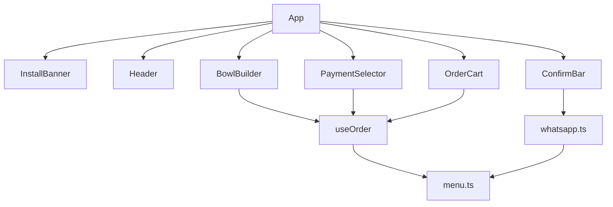

# Release Notes v1.0 — Custom Açaí

## Objetivo

Documentar a **release v1.0** do app de pedidos de açaí: montador de copos, carrinho, pagamento, integração WhatsApp, opção de talher e suporte PWA. Entregar em **dois formatos**:

1. Arquivo versionado: [`docs/releases/v1.0/RELEASE_NOTES.md`](docs/releases/v1.0/RELEASE_NOTES.md)
2. Texto espelhado para colar em **GitHub Release** (mesmo conteúdo, caminhos de imagem ajustados para URLs do repo/tag)

---

## Escopo da release

| Área | Detalhe |
|------|---------|
| Montador | Tamanhos 300ml (R$ 11) e 500ml (R$ 16); frutas (máx. 2); frutas extras e acompanhamentos com preço |
| Talher | Checkbox por copo, +R$ 0,50/un. (`CUTLERY_PRICE` em [`src/lib/menu.ts`](src/lib/menu.ts)) |
| Carrinho | Resumo por linha, remoção, observações, total por item |
| Pagamento | PIX, Dinheiro, Crédito, Débito ([`src/menu.json`](src/menu.json)) |
| WhatsApp | Mensagem formatada via [`src/lib/whatsapp.ts`](src/lib/whatsapp.ts) → `wa.me` |
| PWA | `vite-plugin-pwa`, manifest, Workbox SW, banner de instalação (branch `pwa`, staged) |
| Config | `VITE_STORE_NAME`, `VITE_WHATSAPP_PHONE_E164` ([`.env.example`](.env.example)) |

**Pré-requisito:** commit/merge da branch `pwa` em `main` antes de publicar a tag `v1.0.0`, para que as release notes reflitam o código publicado.

---

## Estrutura do documento

```markdown
# Custom Açaí v1.0.0

## Resumo
## Capturas de tela
## Funcionalidades (usuário)
## Informações técnicas
## Stack e dependências
## Arquitetura
## Configuração e deploy
## Requisitos PWA
## Histórico de commits
## Test plan
```

### Seções técnicas (conteúdo a incluir)

**Stack**
- Node `v20.20.2` ([`.nvmrc`](.nvmrc))
- Vite 5.4, React 19.2, TypeScript 5.9, Tailwind 3.4
- `vite-plugin-pwa` 1.3 (Workbox, `registerType: "autoUpdate"`)

**Arquitetura de componentes**



**PWA — detalhes técnicos** (de [`vite.config.ts`](vite.config.ts), [`src/lib/pwa.ts`](src/lib/pwa.ts), [`src/hooks/useInstallPrompt.ts`](src/hooks/useInstallPrompt.ts))
- Manifest: `name`, `short_name`, `theme_color: #7e22ce`, `display: standalone`, ícones 192/512 + maskable
- Service worker: cache de assets estáticos + Google Fonts (`CacheFirst`, 1 ano)
- Banner: visível se `!isAppInstalled() && !isBannerDismissed()`; dismiss via `sessionStorage`
- iOS: instruções manuais (sem `beforeinstallprompt`); Android/Chrome: prompt nativo
- Meta tags Apple em [`index.html`](index.html): `apple-touch-icon`, `apple-mobile-web-app-capable`

**Precificação** (fonte: [`src/menu.json`](src/menu.json) + [`src/lib/menu.ts`](src/lib/menu.ts))
- Fórmula: `(preço_tamanho + extras) × quantidade + (talher ? 0.50 × quantidade : 0)`
- Frutas base: inclusas (até 2); frutas extras e acompanhamentos: preço unitário adicional

**WhatsApp**
- Endpoint: `https://wa.me/{phone}?text={encodedMessage}`
- Telefone atual hardcoded em [`src/App.tsx`](src/App.tsx) (`5511939107270`) — documentar que `.env.example` prevê migração para env var

**Deploy**
- Build: `npm run build` → `dist/`
- Preview local: `npm run preview`
- Produção: **HTTPS obrigatório** para PWA; host estático (Vercel, Netlify, etc.)

---

## Capturas de tela (prints)

Criar pasta [`docs/releases/v1.0/screenshots/`](docs/releases/v1.0/screenshots/) com PNGs nomeados de forma estável.

| Arquivo | Cena | Viewport |
|---------|------|----------|
| `01-home-desktop.png` | Layout completo (montador + carrinho vazio) | 1280×800 |
| `02-bowl-builder.png` | Montador com tamanho, frutas e complementos selecionados | 1280×800 |
| `03-cutlery-option.png` | Seção "Deseja talher?" com checkbox marcado | 1280×800 |
| `04-cart-with-items.png` | Carrinho com 1–2 itens (incluindo talher) | 1280×800 |
| `05-payment-selector.png` | Formas de pagamento selecionadas | 1280×800 |
| `06-confirm-bar.png` | Barra inferior com total e botão WhatsApp | 1280×800 |
| `07-install-banner-mobile.png` | Banner PWA no topo | 390×844 (iPhone) |
| `08-install-banner-ios-hint.png` | Banner com dica iOS expandida | 390×844 |
| `09-pwa-manifest-devtools.png` | DevTools → Application → Manifest (opcional) | 1280×800 |

**Como capturar (execução)**

1. `npm install && npm run build && npm run preview` (porta 4173)
2. Usar Playwright one-off (script temporário ou CLI) para abrir rotas, preencher estado via UI (clicar tamanhos, toppings, adicionar ao carrinho, marcar talher) e salvar screenshots
3. Alternativa manual: DevTools device toolbar para mobile + captura nativa do SO
4. Referenciar imagens no markdown: ``

**Estado de demo sugerido para screenshots**
- Copo 1: 500ml, banana + morango, paçoca, talher, obs. "sem açúcar"
- Copo 2: 300ml, kiwi extra (+R$ 3), granola
- Pagamento: PIX selecionado
- Total visível na ConfirmBar

---

## Arquivos a criar

| Arquivo | Propósito |
|---------|-----------|
| [`docs/releases/v1.0/RELEASE_NOTES.md`](docs/releases/v1.0/RELEASE_NOTES.md) | Documento principal versionado |
| [`docs/releases/v1.0/screenshots/*.png`](docs/releases/v1.0/screenshots/) | 8–9 capturas |
| [`docs/releases/v1.0/GITHUB_RELEASE.md`](docs/releases/v1.0/GITHUB_RELEASE.md) | Cópia para colar no GitHub (imagens com path relativo ao tag, ex.: `https://github.com/{owner}/{repo}/raw/v1.0.0/docs/releases/v1.0/screenshots/01-home-desktop.png`) |

Opcional: entrada em [`CHANGELOG.md`](CHANGELOG.md) na raiz apontando para `docs/releases/v1.0/`.

---

## Publicação no GitHub (após aprovação do plano)

1. Merge `pwa` → `main` e commit das release notes
2. Tag anotada: `git tag -a v1.0.0 -m "Custom Açaí v1.0.0"`
3. Push tag: `git push origin v1.0.0`
4. Criar release via `gh release create v1.0.0 --title "Custom Açaí v1.0.0" --notes-file docs/releases/v1.0/GITHUB_RELEASE.md`

*(Executar push/tag/release somente se o usuário solicitar.)*

---

## Idioma e tom

- **Português (pt-BR)** em todo o documento
- Seção "Funcionalidades": linguagem para lojista/cliente
- Seção "Informações técnicas": linguagem para desenvolvedor (paths, env vars, fórmulas, APIs)

## Verificação final

- [ ] Todas as 8+ screenshots existem e aparecem no markdown
- [ ] Preços e nomes batem com [`src/menu.json`](src/menu.json)
- [ ] Versões de dependências batem com [`package.json`](package.json)
- [ ] Features PWA descritas batem com arquivos staged na branch `pwa`
- [ ] `npm run build` passa antes de capturar screenshots
