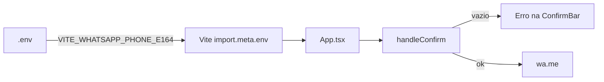

# Telefone WhatsApp via variável de ambiente

## Contexto

O projeto **já possui** a chave e a tipagem; falta apenas usá-la no código:

- [`.env.example`](.env.example) — `VITE_WHATSAPP_PHONE_E164=5511999999999` (placeholder)
- [`src/vite-env.d.ts`](src/vite-env.d.ts) — tipo TypeScript já declarado
- [`src/App.tsx`](src/App.tsx) — ainda hardcoded na linha 12

```11:12:src/App.tsx
const storeName = import.meta.env.VITE_STORE_NAME || "Custom Açaí"
const whatsappPhone = "5511939107270"
```

Você escolheu **exigir a variável** (sem fallback para o número atual).

## Alterações

### 1. [`src/App.tsx`](src/App.tsx)

Substituir o literal por leitura da env var:

```ts
const whatsappPhone = import.meta.env.VITE_WHATSAPP_PHONE_E164?.trim()
```

Em `handleConfirm()`, **antes** de montar a mensagem, validar:

```ts
if (!whatsappPhone) {
  setError("Configure VITE_WHATSAPP_PHONE_E164 no arquivo .env (copie de .env.example).")
  return
}
```

Isso impede abrir o WhatsApp sem configuração e mantém o restante do app utilizável (montar pedido, etc.).

### 2. [`.env.example`](.env.example)

Atualizar o valor de exemplo para o número real da loja, para quem copiar o arquivo já ter o valor correto:

```
VITE_WHATSAPP_PHONE_E164=5511939107270
```

**Ação local necessária:** copiar `.env.example` → `.env` (`.env` está no [`.gitignore`](.gitignore) e não é versionado).

### 3. [`README.md`](README.md) — sincronização mínima

Atualizar a tabela de variáveis (linhas 133–138):

- Status de `VITE_WHATSAPP_PHONE_E164`: de "Documentada, mas **não usada**" → **Ativo**
- Remover o parágrafo que manda editar `whatsappPhone` em `App.tsx`
- Indicar que a variável é **obrigatória** para confirmar pedido

### 4. Sem mudanças necessárias

- [`src/vite-env.d.ts`](src/vite-env.d.ts) — chave já tipada
- [`src/lib/whatsapp.ts`](src/lib/whatsapp.ts) — `openWhatsappOrder` já recebe `phoneE164` como parâmetro

## Fluxo após a mudança



## Verificação

1. Sem `.env`: montar pedido e clicar confirmar → mensagem de erro sobre `VITE_WHATSAPP_PHONE_E164`
2. Com `.env` contendo `VITE_WHATSAPP_PHONE_E164=5511939107270`: confirmar abre `wa.me/5511939107270`
3. `npm run build` conclui sem erro de TypeScript
