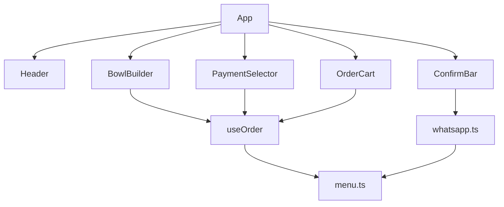

<p align="center">
  
</p>

<h1 align="center">Custom Açaí</h1>

<p align="center">
  Aplicativo web PWA para montar pedidos de açaí personalizados e enviar diretamente pelo WhatsApp.
</p>

<p align="center">
  <strong>Versão:</strong> 1.0.0 &nbsp;·&nbsp;
  <a href="https://github.com/anderson-tec12/custom-acai">Repositório</a>
</p>

---

## Funcionalidades

### Montador de copos
- **Tamanhos:** 300ml (R$ 11,00) e 500ml (R$ 16,00)
- **Frutas inclusas:** até 2 opções sem custo (Banana, Morango, Kiwi, Uva)
- **Frutas extras** e **acompanhamentos** com preço adicional
- **Talher opcional:** +R$ 0,50 por unidade
- **Observações** por copo e **quantidade** configurável

Todos os tamanhos incluem leite em pó e leite condensado.

### Carrinho e pagamento
- Resumo detalhado por item com remoção individual
- Total calculado em tempo real
- Formas de pagamento: PIX, Dinheiro, Cartão de crédito, Cartão de débito

### WhatsApp
- Mensagem formatada com itens, preços, forma de pagamento e total
- Abertura via `wa.me` com texto pré-preenchido

### PWA e layout
- Instalável na tela inicial (Android/Chrome e iOS Safari)
- Manifest, service worker e ícones personalizados
- Layout responsivo (desktop e mobile)
- Cardápio configurável via [`src/menu.json`](src/menu.json)

---

## Capturas de tela

### Tela inicial (desktop)

Layout responsivo com montador de copos à esquerda e carrinho à direita.


### Montador de açaí

Seleção de tamanho (300ml / 500ml), frutas inclusas (até 2), frutas extras e acompanhamentos com preço adicional.


### Opção de talher

Checkbox por copo com acréscimo de R$ 0,50 por unidade.


### Carrinho com itens

Resumo de cada copo com complementos, talher, observações e total por linha.


### Forma de pagamento

Seleção entre PIX, Dinheiro, Cartão de crédito e Cartão de débito.


### Barra de confirmação

Total do pedido e botão para enviar via WhatsApp.


### Banner PWA (mobile)

Barra fixa no topo convidando à instalação do app.


### Instruções iOS

No Safari (iOS), o botão "Instalar" expande instruções para adicionar à Tela de Início.


> **Nota:** O banner customizado de instalação (screenshots acima) foi **removido** na versão atual do código. As imagens referem-se à release v1.0.0. A instalação PWA continua possível pelo menu nativo do navegador:
> - **Chrome (Android):** menu → "Instalar app"
> - **Safari (iOS):** botão Compartilhar → "Adicionar à Tela de Início"

### Manifest PWA

Arquivo `manifest.webmanifest` gerado no build de produção.


---

## Início rápido

### Pré-requisitos

- Node.js **v20.20.2** (use `nvm use` com o [`.nvmrc`](.nvmrc))

### Comandos

```bash
nvm use
npm install
cp .env.example .env
npm run dev      # http://localhost:5173
npm run build    # gera dist/
npm run preview  # http://localhost:4173
```

---

## Configuração

### Variáveis de ambiente

Copie [`.env.example`](.env.example) para `.env`:

| Variável | Descrição | Uso atual |
|----------|-----------|-----------|
| `VITE_STORE_NAME` | Nome exibido no header e na mensagem WhatsApp | Ativo (opcional; padrão: `Custom Açaí`) |
| `VITE_WHATSAPP_PHONE_E164` | Telefone em E.164 (ex.: `551190001111`) | Ativo (opcional; padrão: `5511911110000`) |

### Cardápio

Edite [`src/menu.json`](src/menu.json) sem alterar código:

- `sizes` — tamanhos e preços base
- `toppingCategories` — frutas (com `maxSelect: 2`), frutas extras, acompanhamentos
- `paymentMethods` — formas de pagamento

### Precificação

Fórmula implementada em [`src/lib/menu.ts`](src/lib/menu.ts):

```
total_linha = (preço_tamanho + extras) × quantidade + (talher ? 0.50 × quantidade : 0)
```

- **Frutas base:** inclusas no preço do tamanho (máx. 2)
- **Frutas extras e acompanhamentos:** somados ao preço unitário
- **Talher (`CUTLERY_PRICE`):** R$ 0,50 × quantidade, independente dos extras

---

## Stack técnica

| Tecnologia | Versão |
|------------|--------|
| Node.js | v20.20.2 |
| Vite | 5.4.21 |
| React | 19.2.4 |
| TypeScript | 5.9.3 |
| Tailwind CSS | 3.4.19 |
| vite-plugin-pwa | 1.3.0 |

---

## Estrutura do projeto

```
custom-acai/
├── public/icons/          # Ícones PWA (192, 512, apple-touch-icon)
├── docs/releases/v1.0/    # Release notes e screenshots
├── src/
│   ├── components/        # BowlBuilder, OrderCart, PaymentSelector, ConfirmBar, Header
│   ├── hooks/             # useOrder
│   ├── lib/               # menu.ts, whatsapp.ts
│   ├── menu.json          # Cardápio e preços (fonte de verdade)
│   ├── App.tsx            # Layout principal
│   └── main.tsx           # Entry + registro do service worker
├── vite.config.ts         # Vite + PWA manifest + Workbox
└── index.html             # Meta tags Apple PWA
```

---

## Arquitetura



---

## PWA

Configuração em [`vite.config.ts`](vite.config.ts):

| Campo | Valor |
|-------|-------|
| `name` | Custom Açaí — Monte seu pedido |
| `short_name` | Custom Açaí |
| `theme_color` | `#7e22ce` |
| `background_color` | `#faf5ff` |
| `display` | `standalone` |
| `lang` | `pt-BR` |

- **Ícones:** `public/icons/icon-192.png`, `icon-512.png` (maskable), `apple-touch-icon.png`
- **Service Worker:** Workbox com precache de assets estáticos + cache de Google Fonts (1 ano)
- **Registro:** [`src/main.tsx`](src/main.tsx) via `virtual:pwa-register`
- **HTTPS obrigatório** em produção (localhost é exceção)

---

## Deploy

```bash
nvm use && npm install && npm run build
```

- Saída estática em `dist/`
- Compatível com Vercel, Netlify, GitHub Pages e outros hosts estáticos
- **HTTPS obrigatório** em produção para PWA

---

## Documentação adicional

- [CHANGELOG.md](CHANGELOG.md) — histórico de versões
- [docs/releases/v1.0/RELEASE_NOTES.md](docs/releases/v1.0/RELEASE_NOTES.md) — documentação detalhada da v1.0
