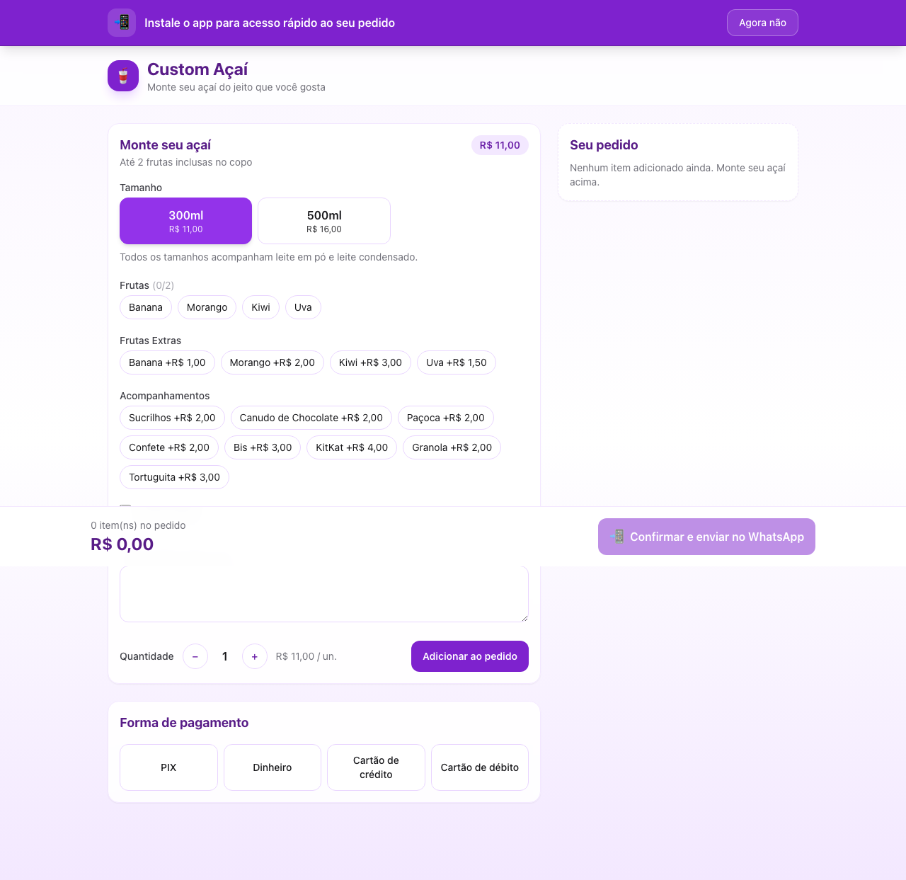
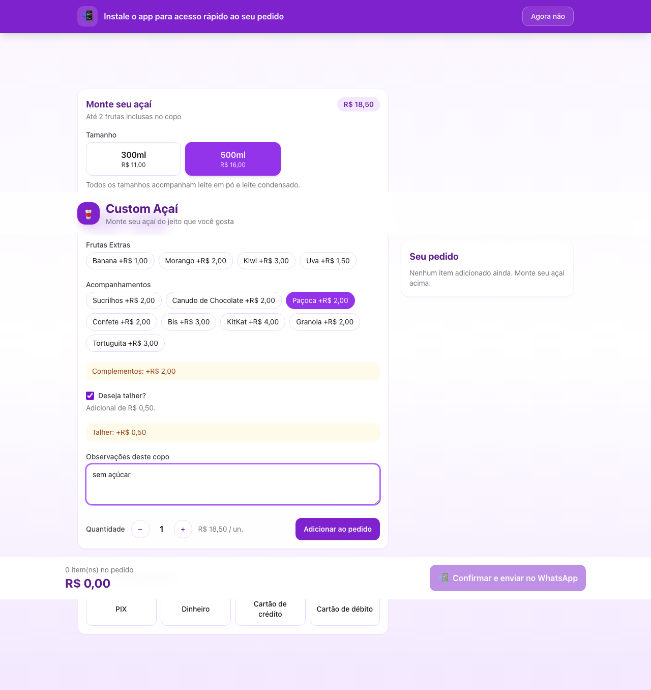
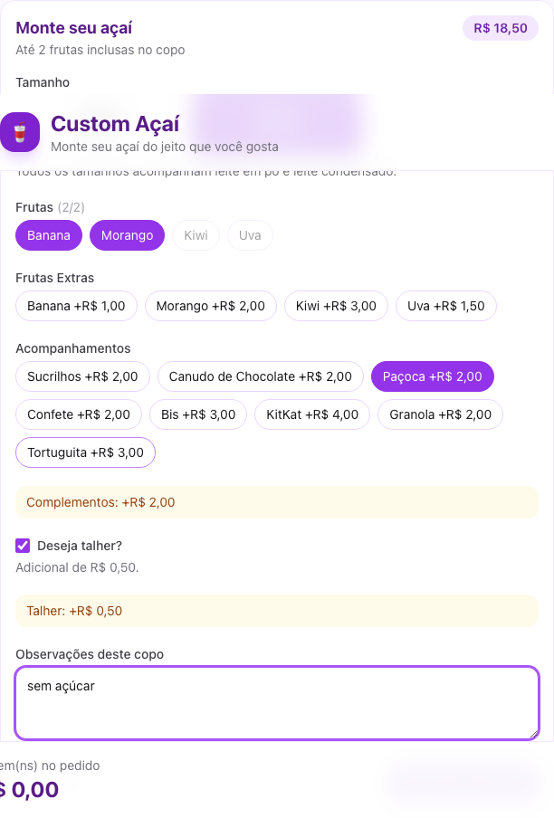
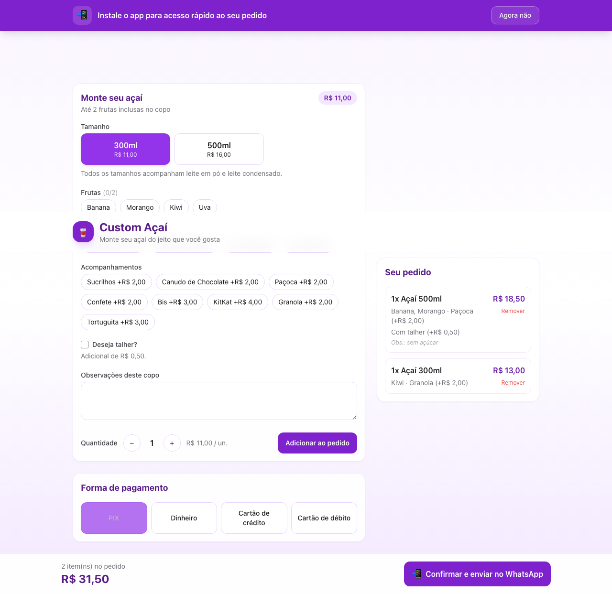
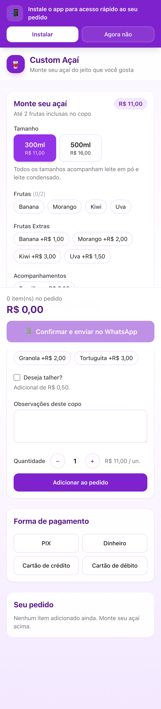
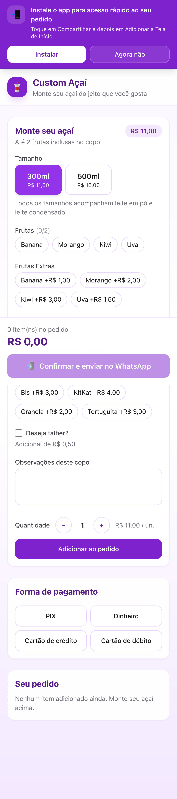
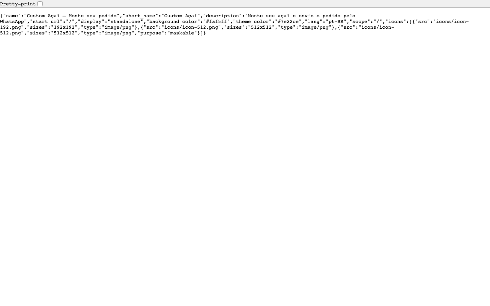
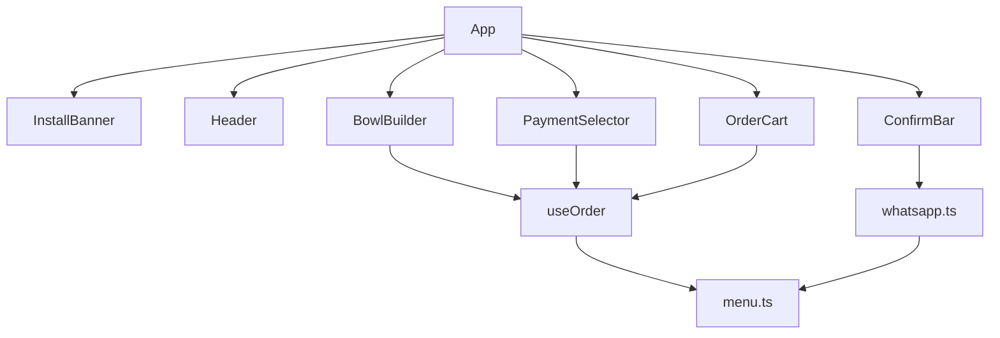

# Custom Açaí v1.0.0

**Data:** 21 de junho de 2026  
**Repositório:** [anderson-tec12/custom-acai](https://github.com/anderson-tec12/custom-acai)

---

## Resumo

A **v1.0.0** é a primeira release estável do **Custom Açaí** — aplicativo web para montagem de pedidos de açaí personalizados com envio direto pelo WhatsApp. O cliente escolhe tamanho, frutas, complementos e forma de pagamento; a loja recebe uma mensagem formatada com todos os detalhes.

Esta versão inclui suporte **PWA** (Progressive Web App): o app pode ser instalado na tela inicial do celular, funciona offline para assets estáticos e exibe um banner convidando à instalação.

---

## Capturas de tela

### Tela inicial (desktop)

Layout responsivo com montador de copos à esquerda e carrinho à direita. Banner PWA visível no topo quando o app não está instalado.



### Montador de açaí

Seleção de tamanho (300ml / 500ml), frutas inclusas (até 2), frutas extras e acompanhamentos com preço adicional.



### Opção de talher

Checkbox por copo com acréscimo de R$ 0,50 por unidade.



### Carrinho com itens

Resumo de cada copo com complementos, talher, observações e total por linha.



### Forma de pagamento

Seleção entre PIX, Dinheiro, Cartão de crédito e Cartão de débito.


### Barra de confirmação

Total do pedido e botão para enviar via WhatsApp.


### Banner PWA (mobile)

Barra fixa no topo convidando à instalação do app.



### Instruções iOS

No Safari (iOS), o botão "Instalar" expande instruções para adicionar à Tela de Início.



### Manifest PWA

Arquivo `manifest.webmanifest` gerado no build de produção.



---

## Funcionalidades (usuário)

### Montador de copos

- **Tamanhos:** 300ml (R$ 11,00) e 500ml (R$ 16,00)
- **Frutas inclusas:** até 2 opções sem custo (Banana, Morango, Kiwi, Uva)
- **Frutas extras:** Banana (+R$ 1,00), Morango (+R$ 2,00), Kiwi (+R$ 3,00), Uva (+R$ 1,50)
- **Acompanhamentos:** Sucrilhos, Canudo de Chocolate, Paçoca, Confete, Bis, KitKat, Granola, Tortuguita (R$ 2,00 a R$ 4,00)
- **Talher:** opcional, adicional de R$ 0,50 por unidade
- **Observações:** campo livre por copo (ex.: "sem açúcar")
- **Quantidade:** múltiplos copos iguais em uma única linha

Todos os tamanhos incluem leite em pó e leite condensado.

### Carrinho

- Lista de copos adicionados com resumo de complementos
- Indicação de talher quando solicitado
- Remoção individual de itens
- Total calculado em tempo real

### Pagamento

- PIX, Dinheiro, Cartão de crédito, Cartão de débito
- Obrigatório antes de confirmar o pedido

### WhatsApp

- Botão "Confirmar e enviar no WhatsApp" abre conversa com mensagem pré-formatada
- Mensagem inclui: itens detalhados, preços, forma de pagamento e total

### PWA / Instalação

- App instalável na tela inicial (Android/Chrome e iOS Safari)
- Banner de instalação em cada visita (dispensável na sessão atual)
- Ícone personalizado com tema roxo (#7e22ce)
- Funciona em modo standalone (sem barra do navegador)

---

## Informações técnicas

### Stack e dependências

| Tecnologia | Versão |
|------------|--------|
| Node.js | v20.20.2 (`.nvmrc`) |
| Vite | 5.4.21 |
| React | 19.2.4 |
| TypeScript | 5.9.3 |
| Tailwind CSS | 3.4.19 |
| vite-plugin-pwa | 1.3.0 (Workbox) |

### Estrutura do projeto

```
custom-acai/
├── public/icons/          # Ícones PWA (192, 512, apple-touch-icon)
├── src/
│   ├── components/        # UI: BowlBuilder, OrderCart, InstallBanner, etc.
│   ├── hooks/             # useOrder, useInstallPrompt
│   ├── lib/               # menu.ts, whatsapp.ts, pwa.ts
│   ├── menu.json          # Cardápio e preços (fonte de verdade)
│   └── App.tsx            # Layout principal
├── vite.config.ts         # Vite + PWA manifest + Workbox
└── index.html             # Meta tags Apple PWA
```

### Arquitetura de componentes



### Precificação

Fórmula implementada em `src/lib/menu.ts`:

```
total_linha = (preço_tamanho + extras) × quantidade + (talher ? 0.50 × quantidade : 0)
```

- **Frutas base:** inclusas no preço do tamanho (máx. 2)
- **Frutas extras e acompanhamentos:** somados ao preço unitário
- **Talher (`CUTLERY_PRICE`):** R$ 0,50 × quantidade, independente dos extras

Cardápio configurável em `src/menu.json` sem alteração de código.

### Integração WhatsApp

- **Endpoint:** `https://wa.me/{phone}?text={encodedMessage}`
- **Telefone:** `5511939107270` (hardcoded em `src/App.tsx`)
- **Variáveis de ambiente previstas:** `VITE_STORE_NAME`, `VITE_WHATSAPP_PHONE_E164` (ver `.env.example`)
- **Formato da mensagem:** gerado por `buildWhatsappMessage()` em `src/lib/whatsapp.ts`

Exemplo de estrutura:

```
*NOVO PEDIDO — Custom Açaí*

*Itens do pedido:*

*1x Açaí 500ml* — R$ 18,50
   • Banana
   • Morango
   • Paçoca (+R$ 2,00)
   • Talher (+R$ 0,50)
   _Obs.: sem açúcar_

─────────────────
*Pagamento:* PIX
*TOTAL: R$ XX,XX*
```

### PWA — configuração

**Manifest** (`vite.config.ts` → gerado em `dist/manifest.webmanifest`):

| Campo | Valor |
|-------|-------|
| `name` | Custom Açaí — Monte seu pedido |
| `short_name` | Custom Açaí |
| `theme_color` | `#7e22ce` |
| `background_color` | `#faf5ff` |
| `display` | `standalone` |
| `lang` | `pt-BR` |
| `start_url` | `/` |

**Ícones:** `public/icons/icon-192.png`, `icon-512.png` (maskable), `apple-touch-icon.png` (180×180)

**Service Worker** (Workbox, `registerType: "autoUpdate"`):

- Precache de assets estáticos (JS, CSS, HTML, PNG, SVG, WOFF2)
- Runtime cache para Google Fonts (`CacheFirst`, TTL 1 ano)
- Registro em `src/main.tsx` via `virtual:pwa-register`

**Banner de instalação** (`src/components/InstallBanner.tsx`):

| Condição | Comportamento |
|----------|---------------|
| App já instalado (`display-mode: standalone` ou iOS standalone) | Banner oculto |
| Dispensado na sessão (`sessionStorage: install-banner-dismissed`) | Banner oculto até nova aba/sessão |
| Chrome/Android com `beforeinstallprompt` | Botão "Instalar" abre prompt nativo |
| iOS Safari | Botão "Instalar" expande instruções manuais |
| Desktop sem critérios PWA | Banner visível; botão "Instalar" oculto |

**Meta tags Apple** (`index.html`):

- `apple-touch-icon` → `/icons/apple-touch-icon.png`
- `apple-mobile-web-app-capable` → `yes`
- `apple-mobile-web-app-status-bar-style` → `default`
- `theme-color` → `#7e22ce`

### Configuração e deploy

**Desenvolvimento:**

```bash
nvm use          # Node v20.20.2
npm install
npm run dev      # http://localhost:5173 (PWA habilitado em dev)
```

**Produção:**

```bash
npm run build    # gera dist/ com SW e manifest
npm run preview  # http://localhost:4173
```

**Variáveis de ambiente** (`.env`):

| Variável | Descrição |
|----------|-----------|
| `VITE_STORE_NAME` | Nome exibido no header e na mensagem WhatsApp |
| `VITE_WHATSAPP_PHONE_E164` | Telefone em E.164 (ex.: `5511999999999`) |

**Requisitos de deploy:**

- **HTTPS obrigatório** para PWA em produção (localhost é exceção)
- Host estático: Vercel, Netlify, GitHub Pages, etc.
- Build com Node ≥ 20 (`.nvmrc`)

### Requisitos PWA (checklist)

- [x] Manifest válido com ícones 192 e 512
- [x] Service worker registrado com precache
- [x] `theme-color` e meta tags mobile
- [x] `display: standalone`
- [x] HTTPS em produção
- [x] Banner de instalação customizado
- [x] Ícone maskable para Android

---

## Histórico de commits

| Commit | Descrição |
|--------|-----------|
| `1bfa4b4` | Início do projeto |
| `f747cdf` | Customização da mensagem WhatsApp |
| `d063f4f` | Ajustes na mensagem do WhatsApp |
| `bb99df7` | Configuração Node via `.nvmrc` |
| `a691d8a` | Ajuste da tabela de preços |
| `f286d1b` | Adição da opção de talher (+R$ 0,50) |
| `1bbb3cf` | Troca do texto informativo do talher |
| `65cb84d` | PWA com banner de instalação |

---

## Test plan

### Montador e carrinho

- [ ] Montar copo 300ml sem complementos → preço R$ 11,00
- [ ] Montar copo 500ml com 2 frutas → preço R$ 16,00
- [ ] Adicionar frutas extras e acompanhamentos → preço atualiza corretamente
- [ ] Marcar talher → acréscimo de R$ 0,50/un.
- [ ] Quantidade 2 com talher → acréscimo de R$ 1,00
- [ ] Adicionar observação → aparece no carrinho
- [ ] Remover item do carrinho → total recalcula

### Pagamento e WhatsApp

- [ ] Tentar confirmar sem itens → exibe erro
- [ ] Tentar confirmar sem pagamento → exibe erro
- [ ] Selecionar PIX e confirmar → abre WhatsApp com mensagem formatada
- [ ] Mensagem lista todos os itens, talher, obs. e total

### PWA

- [ ] `npm run build` completa sem erros (Node 20+)
- [ ] DevTools → Application → Manifest válido
- [ ] DevTools → Application → Service Worker registrado
- [ ] Banner visível no primeiro load (não instalado)
- [ ] "Agora não" esconde banner na sessão
- [ ] Recarregar mesma aba → banner permanece oculto
- [ ] Nova aba → banner reaparece
- [ ] Modo standalone → banner não aparece
- [ ] iOS: botão Instalar mostra instruções

### Responsividade

- [ ] Layout desktop (≥1024px): grid 2 colunas
- [ ] Layout mobile (<1024px): coluna única, carrinho abaixo do montador
- [ ] ConfirmBar fixa no rodapé em todas as resoluções

---

## Scripts auxiliares

Para regenerar as capturas de tela desta release:

```bash
npm run build && npm run preview -- --host 127.0.0.1 --port 4173
node scripts/capture-release-screenshots.mjs
```

Requer Playwright instalado localmente (`npm install --no-save playwright && npx playwright install chromium`).
